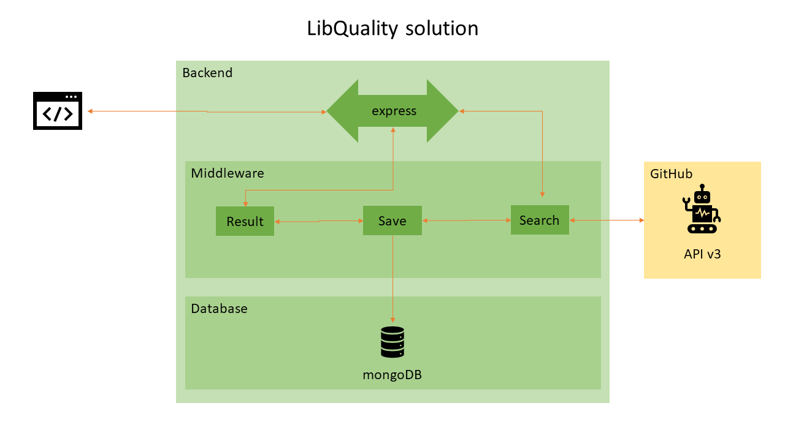

# lib-quality-test

lib-quality-test is a project done as an entry test for Venturus.

## Table of contents
* [General info](#general-info)
* [Technologies](#technologies)
* [Installation](#installation)
* [Usage](#usage)
  * [HTTP](#http)
  * [Javascript Fetch](#javascript-fetch)
  * [Javascript XHR](#javascript-xhr)
  * [cURL](#curl)
  * [PowerShell](#powershell)
  * [wget](#wget)
* [Documentation](#documentation)
* [Thanks](#thankss)

## General info
The project isn't finished.

It doens't have any test and the search isn't stored on any DB.
	
## Technologies
Project is created with:
* [@octokit/graphql](https://github.com/octokit/graphql.js): 4.5.4
* [compression](https://github.com/expressjs/compression): 1.7.4
* [express](https://github.com/expressjs/express): 4.16.1
* [mongoose](https://github.com/Automattic/mongoose): 5.10.1
* [morgan](https://github.com/expressjs/morgan): 1.9.1

## Installation
```
npm install
```

## Usage

### HTTP
```
GET /api/v1/search?q=react HTTP/1.1
Host: localhost:51313
```

### Javascript Fetch
```jsx
var requestOptions = {
  method: 'GET',
  redirect: 'follow'
};

fetch("http://localhost:51313/api/v1/search?q=react", requestOptions)
  .then(response => response.text())
  .then(result => console.log(result))
  .catch(error => console.log('error', error));
```

### Javascript XHR
```jsx
var xhr = new XMLHttpRequest();
xhr.withCredentials = true;

xhr.addEventListener("readystatechange", function() {
  if(this.readyState === 4) {
    console.log(this.responseText);
  }
});

xhr.open("GET", "http://localhost:51313/api/v1/search?q=react");

xhr.send();
```

### cURL
```shell
curl --location --request GET 'http://localhost:51313/api/v1/search?q=react'
```

### PowerShell
```shell
$response = Invoke-RestMethod 'http://localhost:51313/api/v1/search?q=react' -Method 'GET' -Headers $headers -Body $body
$response | ConvertTo-Json
```

### wget
```shell
wget --no-check-certificate --quiet \
  --method GET \
  --timeout=0 \
  --header '' \
   'http://localhost:51313/api/v1/search?q=react'
```

## Documentation

### Explanation
* Decided to use Express because it's higly used by the community, making it easy to anyone to modify/evolve the project.
* Decided to use compression to minimize the size of data being transported.
* Used morgan as a middleware logger to help a little when any error occured.
* Used graphql from octokit to use GitHub GraphQL API, because I found it really easy to use.
* Started to use mongoose to help connect to MongoDB because its developed by a company that I appreciate.

On the first day I deacided to read the instructions and understand everything. Then I decided to draw how I imagined the project:


On the 4th day, as I started to connect to MongoDB I figured that the GitHub REST API wouldn't be usefull because of the limitations. At this point I started to understand the GraphQL API and using It.

After that until the last day I tried to fix somethings and change others. I did not had time to think how I would design the DB.

With no time left, I listed below the things that I left undone:
1. Create dotenv file for configs
1. Create tests for what is done
2. Create login route and save session.
3. Save search term into DB and link this search to the user
4. Save what returned from Github into DB
5. Validate if the term was already searched in the latest 5 min, and if so would get from DB.
6. Divide callGitHub into multiple middleware to se if performance is improved.

## Thanks
Thanks for the opportunity!